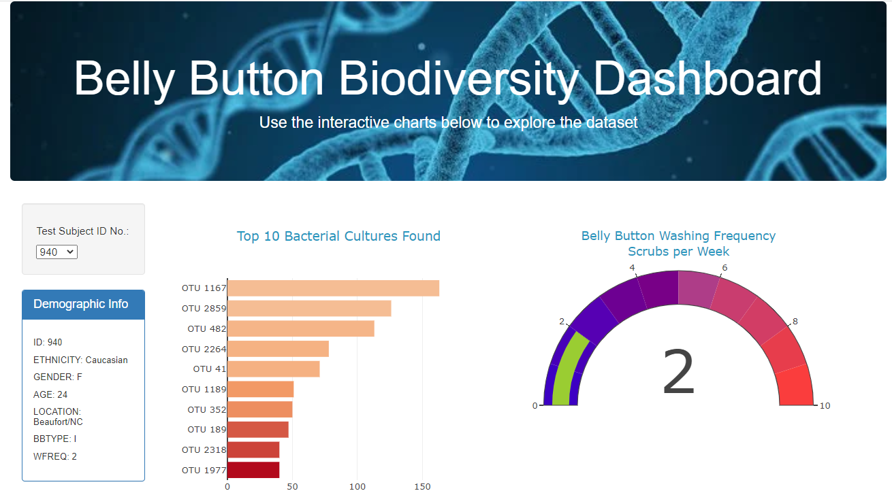
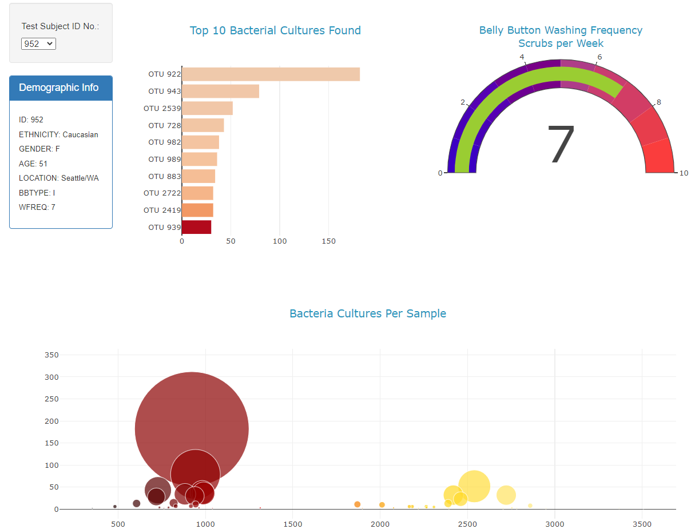

# JS_plotly_challenge

## Project overview

Link to deployed website: [view here](https://afroq.github.io/JS_plotly_challenge/)

Improbable Beef is looking for bacteria that can help flavor synthesized beef product. Our client, Rosa, is a researcher who believes bacteria found in the human navel could provide insight. 

In this project, I take the data Rosa has collected (navel bacteria samples from participants) and build a dashboard that will allow participants to view their "flora" to see if they carry the bacteria species that Improbable Beef needs.

### Deliverables

- Deliverable 1: Create a Horizontal Bar Chart
- Deliverable 2: Create a Bubble Chart
- Deliverable 3: Create a Gauge Chart
- Deliverable 4: Customize the Dashboard

### Summary

I deployed the dashboard on to an [interactive website](https://afroq.github.io/JS_plotly_challenge/) on github pages. 

The participants can filter based on their ID. (By default the website displays the first ID when refreshed or first open):

**When filtered, the demographic info and the charts change:** 

